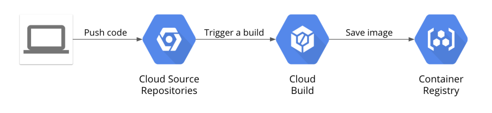

# devops-pipeline
Lab implementation: [Building a DevOps Pipeline](https://www.coursera.org/lecture/cloud-infrastructure-design-process/lab-review-building-a-devops-pipeline-UTYva), using continous integration tools:
- [Cloud Source Repositories](https://cloud.google.com/source-repositories/docs)
- [Cloud Build](https://cloud.google.com/build/docs)
- [Container Registry](https://cloud.google.com/container-registry/docs)

# Objectives
- Create a Git repository using Cloud Source Repositories service
- Create a simple Python Flask web application to test build pipeline
- Define a Docker build
- Manage Docker images with Cloud Build and Container Registry
- Automate builds with triggers
- Test your build changes
